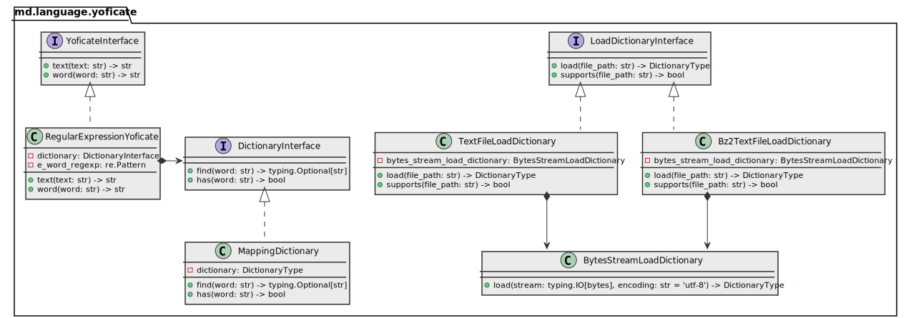

# md.language.yofication

md.language.yofication component provides a cyrillic text yofication (ёфикация) API and CLI application.

This is remastered version of [Yoficator](https://github.com/unabashed/yoficator) 
originally developed by unabashed.

## Architecure overview

[](_static/architecture-overview.class-diagram.svg)

## Component overview

```python3
# Type
DictionaryType = typing.Mapping[str, str]

# ... alias to primary implementation
DefaultYoficate = RegularExpressionYoficate

# ... function to load built-in dictionary
def get_builtin_dictionary(locale: typing.Literal['ru_RU'] = 'ru_RU') -> MappingDictionary: ...
```

## Installation

```sh
pip install md.language.yofication --index https://source.md.land/python/
```

## Usage

CLI Application provides next options:

- `--no-replace` (DEFAULT) — disables original files modification. Modified content is being printed
  to standard output (STDOUT). Conflicts with `--replace` option. Makes no sense when few files arguments are specified. 
- `--replace` — enables original files modifications. Conflicts with `--no-replace` option.
  Makes no sense when no files arguments were specified.

For more details see program help:

```sh
python3 -m md.language.yofication -h
```

Operations with files:

1. Prints the modified text content to standard output (STDOUT) **without changing the file** 
   (the `--no-replace` option is the default).
   ```sh
   python3 -m md.language.yofication ./file.txt  # prints to STDOUT
   ```
2. Replaces specified file with yoficated content
   ```sh
   python3 -m md.language.yofication --replace ./file.txt  # replace in-place
   python3 -m md.language.yofication --replace ./file.txt ./file2.txt ./file3.txt  # replaces files
   find . -type f -iname '*.txt' -exec python3 -m md.language.yofication --replace {} \+  # replaces files
   ```

Operation standard input (STDIN):

1. Reads text from standard input (STDIN) and writes modified text to standard output (STDOUT).
   ```sh
   cat ./file.txt | python3 -m md.language.yofication  # reads from STDIN, prints to STDOUT
   echo "Где ее книга?" | python3 -m md.language.yofication
   python3 -m md.language.yofication <<< "Где ее книга?"
   ```
2. Interactive mode: 
   ```
   $ python3 -m md.language.yofication
   Где ее книга?
   Где её книга?
   ```
